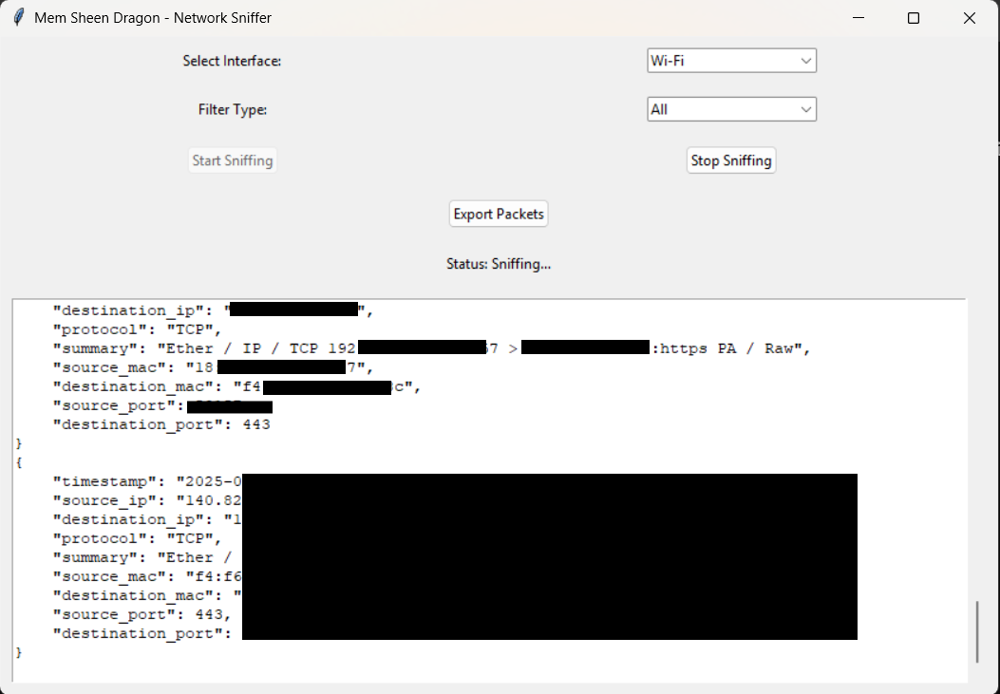

# Mem Sheen Dragon - Network Sniffer

**Mem Sheen Dragon** is a network traffic analysis tool (Network Sniffer) written in Python. The program uses the `scapy` library to capture and analyze network packets and provides a graphical user interface (GUI) using `tkinter` for ease of use. The tool can capture and analyze packets based on various protocols such as TCP, UDP, ICMP, HTTP, DNS, and ARP. It also allows exporting captured data to text files (`txt`), `JSON`, or `CSV`.

---

## :star2: Features

- **Packet Capture**: The program can capture network packets from a specified network interface.
- **Packet Analysis**: Supports analysis of packets using protocols like TCP, UDP, ICMP, HTTP, DNS, and ARP.
- **Graphical User Interface**: Provides an easy-to-use GUI for controlling the packet capture process.
- **Data Export**: Captured data can be exported to text files (`txt`), `JSON`, or `CSV`.
- **Data Storage**: Captured packets are stored in an SQLite database for later reference.
- **Packet Filtering**: Packets can be filtered based on protocol, source IP, or destination IP.

---

## :camera: Screenshots

<div align="center"> 
  
</div>

---

## :space_invader: Tech Stack

- **Language**: Python
- **GUI**: `tkinter`
- **Packet Capture**: `scapy`
- **Database**: `sqlite3`
- **Logging**: `logging`
- **Data Export**: `json`, `csv`

---

## :dart: How to Use

1. **Run the Program**:
   - Run the program using the following command:
     ```bash
     python sniffer.py
     ```

2. **Select Network Interface**:
   - Choose the network interface you want to capture packets from using the dropdown menu.

3. **Start Packet Capture**:
   - Click the "Start Sniffing" button to begin capturing packets.

4. **Stop Packet Capture**:
   - Click the "Stop Sniffing" button to stop capturing packets.

5. **Export Data**:
   - Click the "Export Packets" button to export the captured data to a text file (`txt`), `JSON`, or `CSV`.

---

## :toolbox: Installation

### Prerequisites

- Ensure Python 3.x is installed on your system.
- Install the required libraries using the following command:
  ```bash
  pip install scapy psutil colorama prettytable


Running the Program
Clone the repository:

bash
git clone https://github.com/your-username/mem-sheen-dragon.git
Navigate to the project directory:

bash
cd mem-sheen-dragon
Run the program:

bash
python sniffer.py
:eyes: Usage Examples
Start Packet Capture
python
# Start capturing packets from the selected network interface
app.start_sniffing()
Stop Packet Capture
python
# Stop capturing packets
app.stop_sniffing()
Export Data
python
# Export data to a JSON file
app.export_packets()
:compass: Roadmap
Add a graphical user interface

Support exporting data to text, JSON, and CSV files

Add advanced packet filtering

Support additional protocols like FTP and SSH

Add statistical reports on network traffic

:wave: Contributing
Contributions are welcome! If you'd like to contribute to this project, please follow these steps:

Fork the project.

Create a new branch (git checkout -b feature/YourFeatureName).

Make your changes and stage them (git add .).

Commit your changes (git commit -m 'Add some feature').

Push your changes to the branch (git push origin feature/YourFeatureName).

Open a Pull Request.

:warning: License
This project is licensed under the MIT License.

:handshake: Contact
Name: Mostafa Shaddad

Email: mostafashaddadd@gmail.com

Project: Mem Sheen Dragon

:gem: Acknowledgements
Scapy - Library for capturing and analyzing network packets.

Tkinter - Library for creating graphical user interfaces in Python.

SQLite3 - Lightweight and easy-to-use database.

Mem Sheen Dragon is a powerful and user-friendly tool for analyzing network traffic. If you have any questions or suggestions, feel free to reach out! 😊